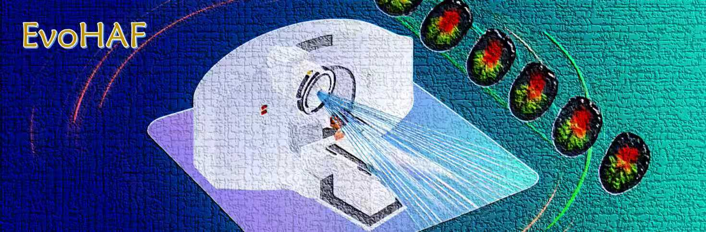

# 🧠 EvoHAF: Evolutionary Heterogeneity Analysis Framework

<div align="center">



<br><br>

**Whole-Process Evolutionary Heterogeneity Analysis for Glioblastoma Radiotherapy Response Prediction**

[](https://github.com)
[](https://www.python.org/)
[](https://pytorch.org/)
[](LICENSE)

</div>

---

## 📢 Important Notice

> **⚠️ This repository is currently under active development.**  
> Our paper is currently under peer review. Should our work be accepted for publication, we will continue to update this repository with:
> - 🔬 Additional experimental results from ongoing clinical studies
> - 📊 Comprehensive supplementary materials and analyses
> - 💡 Further improvements and methodological enhancements
> - 📖 Detailed interpretations of core innovations aligned with the published paper
>
> We appreciate your interest and patience as we progressively release and refine the codebase.

---

## 📖 About

**EvoHAF** is a novel deep learning framework designed for **whole-process evolutionary heterogeneity analysis** in Glioblastoma (GBM) radiotherapy response prediction. Unlike traditional methods that rely on static predictions from fixed time points, EvoHAF integrates longitudinal imaging data throughout the treatment process, capturing both spatial heterogeneity and temporal evolution.

### 🌟 Key Features

- **🔬 Spatial Heterogeneity Representation**: Image Heterogeneity Encoder captures intricate tumor subregion features
- **⏱️ Temporal Evolution Modeling**: Temporal Self-Attention Module (TSAM) integrates longitudinal imaging data
- **🎯 Dynamic Prediction**: Compensated Prediction Head (CPH) refines predictions throughout radiotherapy
- **📊 Multi-Level Interpretability**: Provides visual explanations at both 2D and 3D subregional levels
- **✅ Cross-Center Validation**: Validated on 192 GBM patients across multiple centers

### 🎓 Performance

- **5-fold Validation**: AUC = 0.8519 ± 0.0583


---

## 📂 Project Structure

```
opensource/
├── 📁 components/              # Core model components
│   ├── encoder.py             # Image Heterogeneity Encoder
│   ├── predictor.py           # Longitudinal Predictor with CPH
│   ├── losses.py              # Custom loss functions
│   └── layers.py              # Building blocks (attention, convolution layers)
├── 📁 dataset/                # Data processing modules
│   ├── longitudinal_dataset.py # Longitudinal medical imaging dataset
│   └── utils.py               # Data loading and preprocessing utilities
├── 📁 train/                  # Training pipeline
│   ├── train.py               # Main training script (K-fold CV)
│   ├── trainer.py             # Longitudinal model trainer
│   └── train_utils.py         # Training utilities (early stopping, metrics, etc.)
├── 📁 utils/                  # General utilities
│   └── utils.py               # Helper functions (seed, directories, config)
├── 📁 config/                 # Configuration files
│   └── config_gpu0.yaml       # Example training configuration
├── 📁 docs/                   # Documentation and assets
│   └── cover.png              # Project cover image
├── 📄 longitudinal_subregion_model.py  # Main model architecture
├── 📄 data_format_example.json # Example data format
├── 📄 requirements.txt        # Python dependencies
├── 📄 train.sh                # Quick training script
└── 📄 README.md               # This file
```

---

## 🔧 Installation

### Requirements

- Python >= 3.8
- PyTorch >= 1.10
- CUDA >= 10.2 (for GPU training)

### Install Dependencies

```bash
pip install torch torchvision torchaudio --index-url https://download.pytorch.org/whl/cu118
pip install numpy scikit-learn pyyaml nibabel matplotlib
```

---

## 📊 Data Preparation

### Data Format

Your data should be organized in **JSON format** with the following structure:

```json
{
    "Patient-ID-001": {
        "responses": {
            "1": "progression",
            "2": "non-progression",
            "3": "non-progression",
            "4": "progression"
        },
        "seg_n24": "path/to/segmentation_mask.nii.gz",
        "0": {
            "T1CE": "path/to/timepoint0/T1CE.nii.gz",
            "FLAIR": "path/to/timepoint0/FLAIR.nii.gz"
        },
        "1": {
            "T1CE": "path/to/timepoint1/T1CE.nii.gz",
            "FLAIR": "path/to/timepoint1/FLAIR.nii.gz"
        },
        "2": {
            "T1CE": "path/to/timepoint2/T1CE.nii.gz",
            "FLAIR": "path/to/timepoint2/FLAIR.nii.gz"
        }
    },
    "Patient-ID-002": {
        ...
    }
}
```

### Data Description

- **`responses`**: Treatment response labels at each time point (binary classification)
  - `"progression"`: Tumor progression observed
  - `"non-progression"`: Stable disease or tumor response (no progression)
  
- **`seg_n24`**: Tumor subregion segmentation mask (e.g., SLIC superpixels with 24 regions)

- **Time points (`"0"`, `"1"`, `"2"`, ...)**: Longitudinal MRI scans
  - **`T1CE`**: T1-weighted contrast-enhanced MRI
  - **`FLAIR`**: Fluid-attenuated inversion recovery MRI
  - Additional modalities can be included (e.g., T2, T1)

### Image Format

- All images should be in **NIfTI format** (`.nii.gz`)
- Images should be **co-registered** across modalities and time points
- Recommended voxel spacing: Isotropic (e.g., 1mm³)

---

## ⚙️ Configuration

The training configuration is defined in `config/config_gpu0.yaml`. Here's a detailed explanation:

```yaml
# Cross-Validation Settings
num_folds: 5                    # Number of folds for K-fold cross-validation
seed: 49                        # Random seed for reproducibility
skip_existing_fold: false       # Skip training if fold results exist
gpu_id: 0                       # GPU device ID

# Output Directory
output_dir_base: experiments/results/evohaf_training

# Data Configuration
data:
  batch_size: 4                 # Batch size (adjust based on GPU memory)
  lazy_loading: false           # Load all data into memory (true: load on-the-fly)
  max_time_points: 8            # Maximum number of time points to use
  modality_list:                # MRI modalities to use
    - T1CE                      # T1-weighted contrast-enhanced
    - FLAIR                     # FLAIR
  num_workers: 8                # Number of data loading workers
  resample_size: [128, 128, 128]  # Resample all images to this size
  target_key: responses         # Key for treatment response labels in JSON
  train_json: data/train_data.json  # Path to training data JSON
  val_json: data/val_data.json      # Path to validation data JSON (optional)
  train_segmentation_key: seg_n24   # Segmentation mask key for training data
  val_segmentation_key: seg_n24     # Segmentation mask key for validation data

# Model Architecture
model:
  class_weight: 1.5             # Weight for positive class (for imbalanced data)
  encoder_dilations: [1, 2, 4, 8]  # Dilation rates for encoder layers
  encoder_feature_channels: [16, 32, 48, 64]  # Feature channels for encoder
  feature_dim: 64               # Final feature dimension
  hidden_dim: 64                # Hidden dimension for predictor
  smooth_threshold: 0.3         # Threshold for smoothness regularization
  smooth_weight: 0.1            # Weight for smoothness loss
  use_compensation: true        # Enable Compensated Prediction Head (CPH)
  gru_hidden_dim: 256           # Hidden dimension for GRU in CPH
  compensation_mlp_dim: 96      # MLP dimension in compensation module

# Training Strategy (Two-Stage)
training:
  # Stage 1: Train encoder and predictor
  stage1_epochs: 300            # Maximum epochs for stage 1
  stage1_patience: 200          # Early stopping patience for stage 1
  stage1_lr: 0.001              # Learning rate for stage 1
  stage1_weight_decay: 0.0001   # Weight decay (L2 regularization)
  stage1_checkpoint_interval: 10  # Save checkpoint every N epochs
  
  # Stage 2: Fine-tune compensation module
  stage2_epochs: 50             # Maximum epochs for stage 2
  stage2_lr: 0.0001             # Learning rate for stage 2 (lower than stage 1)
```

### 🎛️ Key Parameters Explained

| Parameter | Description | Recommendation |
|-----------|-------------|----------------|
| `batch_size` | Number of samples per batch | Start with 4, adjust based on GPU memory |
| `max_time_points` | Max longitudinal scans to use | 6-8 for typical radiotherapy schedules |
| `class_weight` | Balance for imbalanced classes | >1 if positive class is rare |
| `use_compensation` | Enable temporal refinement | True for better temporal modeling |
| `stage1_epochs` | Training epochs for main model | 200-300 sufficient for convergence |
| `stage2_epochs` | Epochs for fine-tuning | 30-50 to avoid overfitting |

---

## 🚀 Quick Start

### 1️⃣ Prepare Your Data

Organize your data following the JSON format described above and place it in the `data/` directory.

### 2️⃣ Update Configuration

Edit `config/config_gpu0.yaml` to point to your data:

```yaml
data:
  train_json: data/your_training_data.json
  train_segmentation_key: seg_n24  # Or your segmentation key
```

### 3️⃣ Run Training

**Option A: Using the shell script**

```bash
chmod +x train.sh
./train.sh
```

**Option B: Direct Python execution**

```bash
cd train
python train.py --config ../config/config_gpu0.yaml
```

### 4️⃣ Monitor Training

Training logs and checkpoints will be saved to the directory specified in `output_dir_base`:

```
experiments/results/evohaf_training/
├── fold_0/
│   ├── checkpoints/
│   │   ├── best_model.pth          # Best overall model
│   │   ├── best_model_stage1.pth   # Best model from stage 1
│   │   └── best_model_stage2.pth   # Best model from stage 2
│   ├── results/
│   │   ├── best_internal_metrics_stage1.json
│   │   └── best_internal_metrics_stage2.json
│   └── config_fold.yaml
├── fold_1/
├── ...
└── cross_validation_internal_results.json  # Summary of all folds
```

---

## 🏗️ Model Architecture

EvoHAF consists of three main components:

### 1. 🔬 Image Heterogeneity Encoder

- Extracts spatial heterogeneity features from tumor subregions
- Multi-scale feature extraction with dilated convolutions
- Preserves spatial resolution for interpretability

### 2. ⏱️ Temporal Self-Attention Module (TSAM)

- Models temporal evolution across longitudinal scans
- Self-attention mechanism captures long-range dependencies
- Integrates multi-modal information over time

### 3. 🎯 Compensated Prediction Head (CPH)

- GRU-based temporal refinement
- Dynamically updates predictions as new scans arrive
- Provides whole-process prediction trajectory

---

## 📈 Training Strategy

EvoHAF employs a **two-stage training strategy**:

### Stage 1: Encoder + Predictor
- Train the Image Heterogeneity Encoder and base predictor
- Freeze the compensation module
- Optimize for treatment response prediction

### Stage 2: Compensation Fine-tuning
- Load best model from Stage 1
- Fine-tune only the Compensated Prediction Head
- Refine temporal dynamics and prediction evolution

> **💡 Note**: When you run the training command, the model will **automatically execute both stages sequentially**. These represent the foundational training methodologies. More advanced core innovations and technical details will be thoroughly explained in accompanying documentation upon paper acceptance.

---

## 🔬 Evaluation

After training, evaluate your model:

```python
# Example: Load best model and evaluate
import torch
from longitudinal_subregion_model import GliomaProgressionModel

model = GliomaProgressionModel(...)
checkpoint = torch.load('path/to/best_model.pth')
model.load_state_dict(checkpoint['model_state_dict'])
model.eval()

# Your evaluation code here
```

Metrics saved in `cross_validation_internal_results.json` include:
- **AUC**: Area Under ROC Curve
- **Accuracy**: Classification accuracy
- **F1 Score**: Harmonic mean of precision and recall

---

## 🤝 Contributing

We welcome contributions! As this codebase is under active development, please:

1. Check existing issues before creating new ones
2. Follow the code style in existing files
3. Add comments for complex logic
4. Update documentation as needed

---

## 📄 Citation

If you find this work useful, please cite:

```bibtex
@misc{evohaf2024,
  title={EvoHAF: Evolutionary Heterogeneity Analysis Framework for Glioblastoma Radiotherapy Response Prediction},
  author={ZY-creater},
  year={2024},
  publisher={GitHub},
  howpublished={\url{https://github.com/ZY-creater/EvoHAF}}
}
```

> **📝 Citation will be updated with full paper details upon publication acceptance.**

---

## 📧 Contact

For questions and discussions:

- **Issues**: Please use GitHub Issues for bug reports and feature requests


---

## 📜 License

License information will be added upon paper acceptance.

---

## 🙏 Acknowledgments

We thank all collaborating institutions for providing the valuable clinical data that made this research possible.

---

<div align="center">

**⭐ If you find this project helpful, please consider giving it a star! ⭐**

</div>
